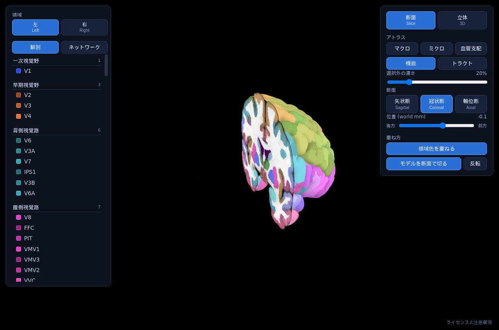

# brain-atlas-viewer

3D の脳モデルを断面で切り、切り口に MRI と領域色を出す Web ビューア。5 つの
アトラスを切り替えて見る。

**[開く](https://tontonkurakura.github.io/brain-atlas-viewer/viewer.html)**



## 中身

| アトラス | 区分 | 出どころ |
|---|---|---|
| 解剖学領域（マクロ） | 10 | DKT を脳葉などへまとめたもの。**既定** |
| 解剖学領域（ミクロ） | 93 | Desikan-Killiany-Tourville |
| 血管支配領域 | 32 | JHU Arterial Atlas Level 1 |
| 機能的領域 | 360 | HCP-MMP1（Glasser）。解剖 22 区分と Yeo 7 ネットワークで並べ替えられる |
| トラクトグラフィー | 87 | HCP1065 の平均トラクト。選ぶと繋ぐ皮質領域も色付く |

## 作り

- 標準脳は MNI152。3D モデルと断面画像を重ねて見せる
- **座標はすべて world RAS (mm)。**メッシュも断面もクリップ面も同じ数値なので、
  座標変換のコードが存在しない。詳しくは [docs/spec.md](docs/spec.md)
- 依存は同梱の three.js r163 だけ。ビルド手順も外部への通信も無い
- 静的ファイルを配るだけで動く

```bash
python3 -m http.server 8791    # このフォルダで
```

**`file://` では動かない。**ブラウザが `file://` からのデータ取得を遮断するため、
断面画像も 3D モデルも届かない。開くと画面がそう言う。

## 使うにあたって

**診断や臨床判断の材料には使わないこと。**教育と参照を目的としている。領域の
区分は自動処理の結果で、個々の症例に当てはまるものではない。左右の向きは
neurological（画像の左が患者の左）。

## ライセンスと出典

画面右下の「ライセンスと注意事項」に全文がある。派生物の扱いだけここに書く。

| | |
|---|---|
| `brain_arterial.glb` / `label_atlas_arterial.webp` | [CC BY-SA 4.0](https://creativecommons.org/licenses/by-sa/4.0/)（JHU Arterial Atlas から継承） |
| `vendor/three/` | MIT |
| MNI152 / FreeSurfer / FastSurfer / HCP-MMP1 / HCP1065 | 各配布元に従う |

> Liu C-F, et al. *Digital 3D Brain MRI Arterial Territories Atlas.*
> Scientific Data 10, 74 (2023). © 2021 The Johns Hopkins University
>
> Glasser MF, et al. *A multi-modal parcellation of human cerebral cortex.*
> Nature 536, 171–178 (2016)
>
> Yeh F-C, et al. *Population-averaged atlas of the macroscale human structural
> connectome and its network topology.* NeuroImage 178, 57–68 (2018)

## このリポジトリについて

生成物だけを置いてある。作っているのは別のリポジトリで、そちらに資産を作る
Python のパイプラインと、ビューアの元がある。

参照実装として別の開発者へ渡している版が
[brain-slice-viewer](https://github.com/tontonkurakura/brain-slice-viewer) にある。
あちらはアトラス 3 つで止めてあり、座標の取り決めと手法を伝えることが目的。
